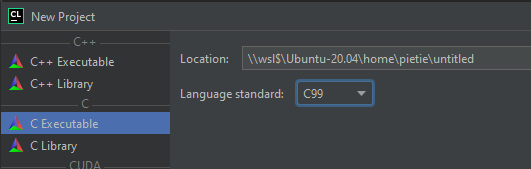

ifndef::includedir[]
ifndef::backend-pdf[]
:includedir: ./
endif::[]
ifdef::backend-pdf[]
:includedir: https://git.thm.de/arin07/KSP_public/-/blob/master/aufgaben/a-pre/
endif::[]
endif::[]
== KSP Vorbereitung zum Praktikum

=== Installation Entwicklungsumgebung

==== Alternative 1: Installation eigenes Linux

Installieren Sie Linux auf Ihrem Rechner (Tipp: Ubuntu). Machen Sie sich mit dem Installieren von Paketen vertraut (`apt`). Sie benötigen einen Editor Ihrer Wahl, sowie die üblichen Entwicklungswerkzeuge (gcc, bison, flex, make, cmake). Außerdem sind folgende Programme ganz hilfreich: Debugger (gdb) und Speicherprüfer (valgrind).

==== Alternative 2: Verwendung der vorbereiteten VirtualBox VM

Unter link:https://hbx.fhhrz.net/getlink/fiHxBP28Hf4Y1rKx3MJHGoRz/debs%2011.ova[] können Sie ein VM Image für Oracle VirtualBox (link:https://www.virtualbox.org/[]) herunterladen, das alle Anforderungen zur Entwicklung der Ninja VM erfüllt. Wenn Sie bereits Linux auf Ihrem System installiert haben, empfiehlt es sich trotzdem die bereitgestellte VM zu verwenden, da dort alle benötigten Pakete installiert sind. Beachten Sie bitte: Wir geben keinen Support für Probleme die auf Eigeninstallationen auftreten. D.h. Benutzen Sie Ihr eigenes System, kümmern Sie sich bitte selbst darum, dass alles läuft. Was in der Regel heißt bestimmte Softwarepakete zu installieren.

Das Passwort für den Benutzer (`student`) der bereitgestellten Virtualbox VM: `student` 

Hier noch eine Liste an installierten/verfügbaren IDEs und Editoren:

* Atom (Open Source Editor und IDE)
* Visual Studio Code (Open Source Editor und IDE)
* Sublime Text 3 (installiert, keine Lizenz)
* VIM (Editor, IDE, ...)
* CLION (Jetbrains, muss selbstständig installiert werden. Lizenz kann kostenlos geholt werden: link:https://www.jetbrains.com/shop/eform/students[])

Generell sollte für diesen Kurs auch MacOSX oder ein Windows 10 mit WSL2 ausreichen, solange alle notwendigen Pakete installiert sind. Hier sind sie jedoch auch auf sich alleine gestellt.

==== Alternative 3: Programmierumgebung für KSP mit CLion und WSL2

. Windows Subsystem for Linux (WSL) installieren
(link:https://docs.microsoft.com/en-us/windows/wsl/install[Tutorial])
. Ubuntu(WSL) installieren (link:https://ubuntu.com/wsl[Tutorial])
.. Ubuntu starten und die Erstkonfiguration abschließen
.. Paketquellen und Pakete aktualisieren: +
`sudo apt update && sudo apt upgrade -y`
.. Benötigte Pakete installieren: +
`sudo apt install build-essential cmake valgrind python3 python3-pip -y`
.. Benötigtes python Paket installieren: +
`python3 -m pip install pipenv` +
_Manche dieser Pakete werden nur für die Abgaben der Hausübungen benötigt, sie können jedoch jetzt schon installiert werden._

[start=3]
. link:https://www.jetbrains.com/de-de/clion/[CLion] installieren und mit Hochschullizenz aktivieren _Zum Erhalt der Lizenz muss ein Account mit Ihrer Hochschuladresse angelegt werden. (link:https://www.jetbrains.com/de-de/community/education/#students[Infos zur Education Lizenz]_) link:https://www.jetbrains.com/shop/eform/students[]
.. WSL Toolchain einrichten
(link:https://www.jetbrains.com/help/clion/how-to-use-wsl-development-environment-in-product.html#wsl-tooclhain[Tutorial])
[arabic]
... Sollte beim Einrichten der Toolchain der Fehler _"Test CMake run
finished with errors"_ auftreten, so muss in der WSL folgender Befehl
ausgeführt werden:
+
[source,shell]
----
sudo bash -c 'cat > /etc/wsl.conf << EOF 
[automount]
enabled = true
options = "metadata"
EOF'
----
.. (_Optional_) Valgrind in CLion einrichten
(link:https://www.jetbrains.com/help/clion/memory-profiling-with-valgrind.html[Tutorial])
. Ich empfehle an dieser Stelle nun ein git Projekt im WSL zu erstellen oder es von dem THM GitLab zu clonen +

[source, shell]
----
$git clone git@git.thm.de:arin07/KSP_public.git
----

[start=5]
. Wenn nun in CLion ein neues Projekt erstellen können wir direkt den Ordner aus dem WSL öffnen. (Z.B. `\\wsl$\Ubuntu-20.04\...` wobei `...` dann der Pfad zu dem git Ordner in WSL ist). +
Hierbei sollte natürlich "*C Executable*" mit dem *C99* Standard gewählt werden: +

. In dem Ordner wird dann mit CLion eine `CMakeLists.txt` Datei erstellt, welche dann mindestens folgendes enthalten sollte:

.Datei: CMakeLists.txt
[source, cmake]
----
cmake_minimum_required(VERSION 3.16)
project(njvm C)

set(CMAKE_C_STANDARD 99)

add_compile_options(-g -Wall -pedantic)

add_executable(njvm njvm.c)
----

Nun sollte dem Programmieren mit Clion unter WSL nichts im Wege stehen!

=== Ein erstes Programm

. Editieren Sie folgendes Programm mit einer IDE / einem Editor Ihrer Wahl in einer Datei `hello.c`:

[source, c]
----
#include <stdio.h>
int main(int argc, char *argv[]) {
    printf("Hello, world!\n");
    return 0;
}
----

[start=3]
. Übersetzen und binden Sie das Programm mit der Kommandozeile

[source, shell]
----
$ gcc -g -Wall -std=c99 -pedantic -o hello hello.c
----

[start=4]
. Lassen Sie das Programm laufen mit der Kommandozeile

[source, shell]
----
$ ./hello
----

Es muss den Text "Hello, world!" (ohne die Anführungszeichen, mit einem Zeilenumbruch am Ende) ausgeben.
